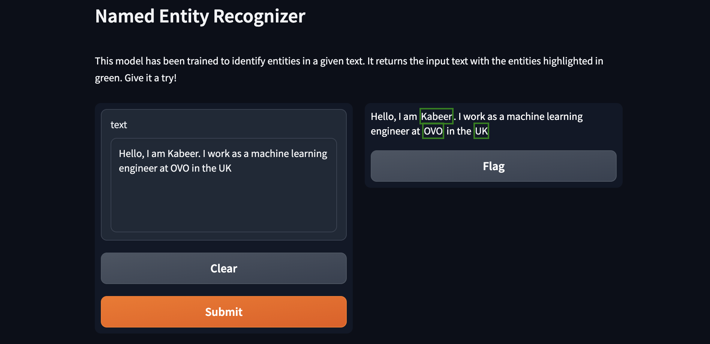

Check out the configuration reference at https://huggingface.co/docs/hub/spaces-config-reference

# Named Entity Recognition App

## Overview
This repository contains the source code for a Named Entity Recognition (NER) application. The app is built using Hugging Face's Transformers and Gradio, allowing users to input text and receive identified named entities. It utilizes a fine-tuned BERT model (`koakande/bert-finetuned-ner`) for high-accuracy entity recognition.

## Features
- **Interactive NER**: The core feature of this app is to identify named entities in any given text. It classifies entities into predefined categories like names, locations, organizations, etc.
- **Hugging Face Integration**: The app is designed to be compatible with Hugging Face Spaces, providing a user-friendly interface and easy access.

## Demonstration
The image below shows the app in action. You can also try it [here!](https://huggingface.co/spaces/koakande/named_entity_recognition)



## Repository Structure

```graphql
named-entity-recognition-main/
│
├── .gitattributes
├── .gitignore
├── README.md
├── app.py
│
├── notebooks/
│ ├── Named_Entity_Recognition_Demo.ipynb
│ └── named_entity_recognition_dev.ipynb
│
├── poetry.lock
└── pyproject.tom
```

- `app.py`: Main application file which contains the Gradio interface and model integration.
- `notebooks/`: Contains Jupyter notebooks for development and demonstration purposes.
- `pyproject.toml` & `poetry.lock`: Defines project dependencies and their locked versions for Poetry.

## Getting Started
To run this app locally, clone the repository:

```bash
git clone git@github.com:kbakande/named-entity-recognition.git
cd named-entity-recognition
```

## Managing Dependencies with Poetry
* This project uses Poetry for dependency management. To install dependencies, ensure you have Poetry installed and then run:
    ```bash
    poetry install
    ```
* Run the application
```bash
poetry run python app.py
```

## Interacting with the App on Hugging Face Spaces
Interact with a live version of this app hosted on Hugging Face Spaces. Visit the [Named Entity Recognition App](https://huggingface.co/spaces/koakande/named_entity_recognition) on Hugging Face Spaces to try out the app without any local setup.

## Contributing
Contributions to improve the app or documentation are welcome. Please read our contributing guidelines to get started.

## Dependencies

Key Python libraries and frameworks used in this project:

* [Transformers](https://pypi.org/project/transformers/)
* [Dataset](https://pypi.org/project/datasets/)
* [Evaluate](https://pypi.org/project/evaluate/)
* [Gradio](https://pypi.org/project/gradio/)
* [Sentencepiece](https://pypi.org/project/sentencepiece/)
* [Torch](https://pypi.org/project/torch/)

## Author
[Kabeer Akande](https://www.linkedin.com/in/koakande/)